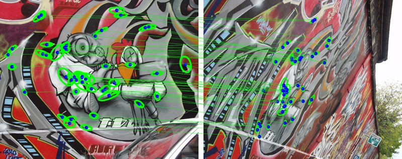
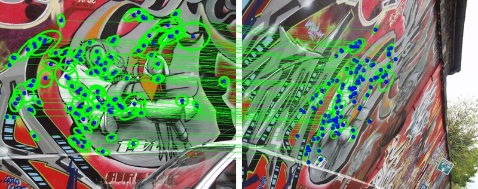

# AffNet model implementation
CNN-based affine shape estimator.

AffNet model implementation in PyTorch for TechReport "[Learning Discriminative Affine Regions via Discriminability](https://arxiv.org/abs/1711.06704)"

AffNet generates up to twice more correspondeces compared to Baumberg iterations




## Datasets and Training

To download datasets and start learning affnet:

```bash
git clone https://github.com/ducha-aiki/affnet
./run_me.sh
```

## Pre-trained models

Pre-trained models can be found in folder pretrained:  AffNet.pth

## Usage example

We provide two examples, how to estimate affine shape with AffNet. 
First, on patch-column file, in [HPatches](https://github.com/hpatches/hpatches-benchmark) format, i.e. grayscale image with w = patchSize and h = nPatches * patchSize

```
cd examples/just_shape
python detect_affine_shape.py imgs/face.png out.txt
```

Out file format is upright affine frame a11 0 a21 a22


Second, AffNet inside pytorch implementation of Hessian-Affine

2000 is number of regions to detect.

```
cd examples/hesaffnet
python hesaffnet.py img/cat.png ells-affnet.txt 2000
python hesaffBaum.py img/cat.png ells-Baumberg.txt 2000
```

output ells-affnet.txt is [Oxford affine](http://www.robots.ox.ac.uk/~vgg/research/affine/) format 
```
1.0
128
x y a b c 
```

## Citation

Please cite us if you use this code:

```
@article{AffNet2017,
 author = {Dmytro Mishkin, Filip Radenovic, Jiri Matas},
    title = "{Learning Discriminative Affine Regions via Discriminability}",
     year = 2017,
    month = nov}
```
